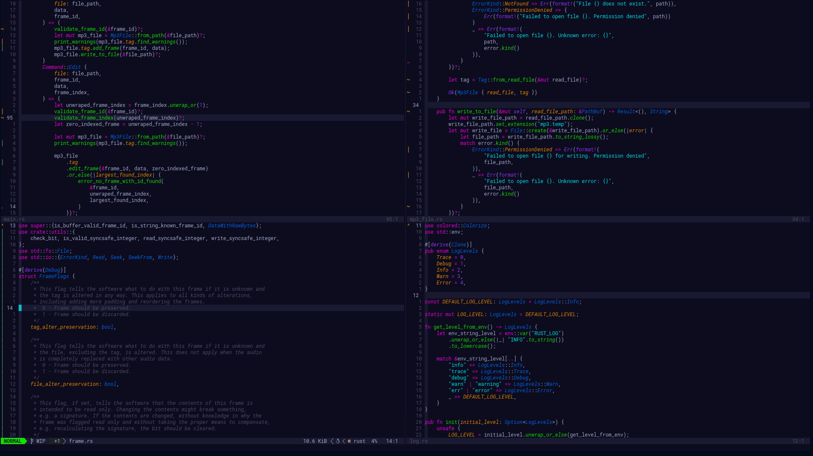

# Neon TokyoDark



### About

A dark bold neon theme for Neovim.

### Features

- Support for numerous plugins
- Customizable
- Italic Support

### Installation

Install with your favorite package manager:

[packer](https://github.com/wbthomason/packer.nvim)

``` lua
use 'jeansidharta/tokyodark.nvim'
```

[vim-plug](https://github.com/junegunn/vim-plug)

``` vim
Plug 'jeansidharta/tokyodark.nvim'
```

### Available configuration

**Note:** The configuration options should be placed before
`colorscheme tokyodark` .

- `tokyodark_transparent_background`: Set to enable transparent
  background.
- `tokyodark_enable_italic_comment`: Set to enable italic in `Comment` .
- `tokyodark_enable_italic`: Set to italicize keywords. This option is
  designed to use with fonts that support italic styles, for example
  [Fira Code, MonoLisa, Dank Mono](https://www.nerdfonts.com/).
- `tokyodark_color_gamma`: Change to adjust the brightness of the theme.
  (Darker \< 1.0 \< Lighter).

#### Default configuration

``` lua
-- init.lua
vim.g.tokyodark_transparent_background = false
vim.g.tokyodark_enable_italic_comment = true
vim.g.tokyodark_enable_italic = true
vim.g.tokyodark_color_gamma = "1.0"
vim.cmd("colorscheme tokyodark")
```

``` vim
" .vimrc
let g:tokyodark_transparent_background = 0
let g:tokyodark_enable_italic_comment = 1
let g:tokyodark_enable_italic = 1
let g:tokyodark_color_gamma = "1.0"
colorscheme tokyodark
```
